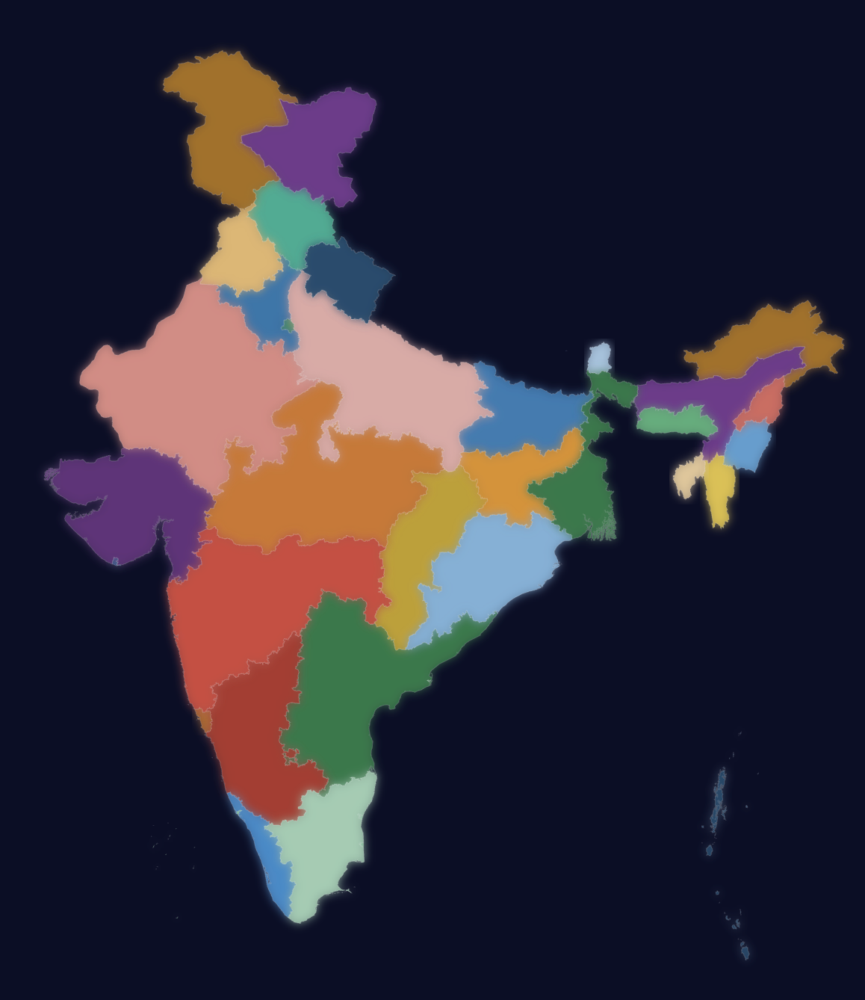

# India Official Boundaries — GeoJSON & TopoJSON

**The correct map of India.** Every state, every union territory, every square kilometer — including the parts that most open-source maps conveniently forget.

<p align="center">
  <br>
  
</p>

## Why This Exists

Almost every India GeoJSON/TopoJSON on GitHub, npm, and Kaggle is **wrong**. They show:

- Jammu & Kashmir cut at the Line of Control (LoC) — Kashmir was, is, and will always remain an integral part of India
- Aksai Chin missing — illegally occupied by China, but sovereign Indian territory
- Ladakh merged with J&K — ignoring the 2019 reorganization into separate Union Territories
- Arunachal Pradesh shown as "disputed" — it's not disputed, it's India. Period.

**This repo fixes that.** Using boundary data from [india-in-data/kashmir](https://github.com/india-in-data/kashmir) for J&K and Ladakh, merged with comprehensive state data, this provides India's map as per the **Survey of India** and the **Government of India's official position**.

## What's Included

| File | Size | Description |
|------|------|-------------|
| `india-states-full.geojson` | 11.9 MB | Full resolution, all 32 states/UTs |
| `india-states-simplified.geojson` | 444 KB | Simplified (~1km resolution), web-friendly |
| `india-states.topojson` | 166 KB | TopoJSON, smallest, best for web apps |

## States & Union Territories (32)

All 28 states + 4 key UTs included. Jammu & Kashmir and Ladakh as **separate union territories** (post-August 2019).

### Key Boundaries

- **Jammu and Kashmir**: Full extent including PoK, Gilgit-Baltistan, Siachen (72.5°E to 77.5°E, up to 37°N)
- **Ladakh**: Full extent including Aksai Chin (75.4°E to 80.3°E, up to 36°N)
- **Arunachal Pradesh**: Full extent (91.5°E to 97.4°E, up to 29.5°N)

All states and union territories are included. Nothing is excluded.

## Usage

### React (react-simple-maps)

```jsx
import { ComposableMap, Geographies, Geography } from "react-simple-maps";

<ComposableMap projection="geoMercator"
  projectionConfig={{ rotate: [-83, 0, 0], scale: 850, center: [0, 23] }}>
  <Geographies geography="/india-states.topojson">
    {({ geographies }) =>
      geographies.map((geo) => (
        <Geography key={geo.rsmKey} geography={geo} />
      ))
    }
  </Geographies>
</ComposableMap>
```

### D3.js

```javascript
const topo = await fetch("/india-states.topojson").then(r => r.json());
const states = topojson.feature(topo, topo.objects.data);
```

### Python

```python
import json
with open("india-states-simplified.geojson") as f:
    india = json.load(f)
```

## Data Sources

- **Base state boundaries**: [Subhash9325/GeoJson-Data-of-Indian-States](https://github.com/Subhash9325/GeoJson-Data-of-Indian-States)
- **J&K + Ladakh (with PoK, Siachen, Aksai Chin)**: [india-in-data/kashmir](https://github.com/india-in-data/kashmir)
- **Simplification**: Shapely (0.01° tolerance ≈ 1km), TopJSON Python library

## Legal

Displaying an incorrect map of India is an offence under the **Geospatial Information Regulation Bill** and the **Criminal Law (Amendment) Act**. Maps must conform to the boundaries as depicted by the **Survey of India**.

This data is provided for educational and development purposes. Always verify boundaries against the latest Survey of India publications.

## Contributing

Found an inaccuracy? Open an issue or PR. The goal is to maintain the most accurate open-source India map data available.

## License

MIT — use freely in commercial and personal projects. Attribution appreciated.

---

**Jai Hind. Vande Mataram. Bharat Mata Ki Jai.**
